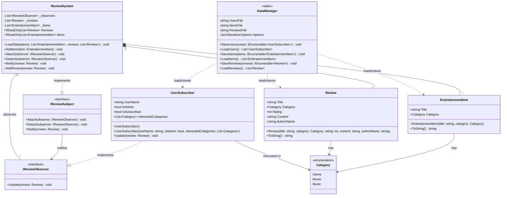

# System Class Diagram

This class diagram explains the data structures and relationships within the `SWD-ConsoleAppReviewer` system. It visualizes the core models, the [ReviewSystem](file:///d:/University%20stuffs/Coding/SWD/SWD-ConsoleAppReviewer/Entertainment%20Reviews/Entertainment%20Reviews/System/ReviewSystem.cs#6-77) that manages them, and the [DataManager](file:///d:/University%20stuffs/Coding/SWD/SWD-ConsoleAppReviewer/Entertainment%20Reviews/Entertainment%20Reviews/System/DataManager.cs#7-54) responsible for persistence.

## Key Components
- **Models ([EntertainmentItem](file:///d:/University%20stuffs/Coding/SWD/SWD-ConsoleAppReviewer/Entertainment%20Reviews/Entertainment%20Reviews/Models/EntertainmentItem.cs#3-17), [Review](file:///d:/University%20stuffs/Coding/SWD/SWD-ConsoleAppReviewer/Entertainment%20Reviews/Entertainment%20Reviews/Models/Review.cs#3-25), `Category`)**: Represent the core data objects. Reviews and Items are categorized by the `Category` enum.
- **[UserSubscriber](file:///d:/University%20stuffs/Coding/SWD/SWD-ConsoleAppReviewer/Entertainment%20Reviews/Entertainment%20Reviews/Subscribers/UserSubscriber.cs#14-16)**: Represents a user. Implements `IReviewObserver` to receive notifications when new reviews are posted on categories they're interested in.
- **[ReviewSystem](file:///d:/University%20stuffs/Coding/SWD/SWD-ConsoleAppReviewer/Entertainment%20Reviews/Entertainment%20Reviews/System/ReviewSystem.cs#6-77)**: The central state manager. It acts as the `IReviewSubject` (Publisher in the Observer pattern). It holds the lists of reviews, items, and subscribed observers, handling the core business logic during runtime.
- **[DataManager](file:///d:/University%20stuffs/Coding/SWD/SWD-ConsoleAppReviewer/Entertainment%20Reviews/Entertainment%20Reviews/System/DataManager.cs#7-54)**: A static utility class used for serializing and deserializing the system's data ([Users](file:///d:/University%20stuffs/Coding/SWD/SWD-ConsoleAppReviewer/Entertainment%20Reviews/Entertainment%20Reviews/System/DataManager.cs#21-27), [Items](file:///d:/University%20stuffs/Coding/SWD/SWD-ConsoleAppReviewer/Entertainment%20Reviews/Entertainment%20Reviews/System/DataManager.cs#34-40), [Reviews](file:///d:/University%20stuffs/Coding/SWD/SWD-ConsoleAppReviewer/Entertainment%20Reviews/Entertainment%20Reviews/System/DataManager.cs#47-53)) to and from JSON files.
